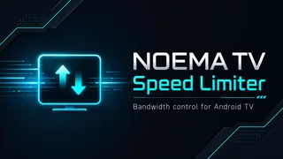
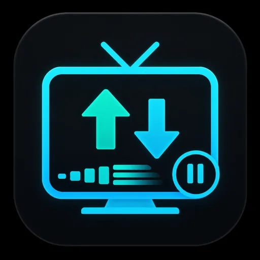

# NOEMA TV Speed Limiter

<p align="center">
  
</p>

<p align="center">
  
</p>

**Bandwidth control for Android TV.** NOEMA TV Speed Limiter is a lightweight, remote-friendly Android TV app for travel, rehab, hotels, mobile hotspots and other metered connections.

It provides four simple profiles:

- **2 Mbit/s Saver** — maximum data saving
- **4 Mbit/s Balanced** — everyday streaming
- **6 Mbit/s Comfort** — more quality and headroom
- **Full Speed Home** — disables the limiter completely

The download limit is device-wide. Upload is currently unrestricted.

## How it works

NOEMA uses Android's local `VpnService` as a traffic-control path. It does **not** send your traffic through an external VPN provider or remote NOEMA server.

Traffic path:

`App traffic -> Android VpnService TUN -> HEV tun2socks -> local SOCKS5 relay -> physical Wi-Fi/mobile network`

The download shaper uses a shared token bucket so simultaneous connections share the selected bandwidth budget.

## Easy installation on Xiaomi / Android TV

The easiest method is **Send Files to TV**.

1. Download the latest NOEMA TV Speed Limiter APK to your Android phone.
2. Install **Send Files to TV** on both your phone and your Android TV / Xiaomi TV Stick.
3. Open **Send Files to TV** on the TV and choose **Receive**.
4. On the phone choose **Send** and select the NOEMA APK.
5. Select your TV / Xiaomi Stick as the destination.
6. On the TV, open the received `.apk` file.
7. If Android asks for permission to install unknown apps, allow it for the file-transfer or file-manager app you are using.
8. Install **NOEMA TV Speed Limiter**.
9. Start NOEMA and choose **2, 4 or 6 Mbit/s**.
10. Android shows a one-time VPN permission dialog. Accept it. This is only the local Android VPN interface required for traffic shaping.
11. Open YouTube, Waipu, Netflix or another streaming app and test playback.

To restore unrestricted internet, open NOEMA and select **Full Speed Home**.

### Play Protect warning

A manually installed APK can trigger a Play Protect warning because it did not come from Google Play. Only install APKs obtained from this repository, its GitHub Actions build artifacts, an official project release, or a build you created yourself from the source code. There is no need to disable Play Protect globally.

## Built-in Diagnostics

NOEMA includes a **Diagnostics** screen so networking problems can be investigated directly on the TV without ADB. It displays:

- Android/API version
- selected physical network and DNS
- local SOCKS listener
- TUN status and MTU
- HEV tun2socks status
- SOCKS connection count
- TCP connect success/failure counters
- UDP associations and packet counters
- traffic counters
- last detected networking error

Diagnostics remain local on the device.

## Privacy

NOEMA has no account system, no analytics and no remote telemetry. The app does not require a third-party VPN server. Network traffic is forwarded directly through the device's physical network.

## Compatibility and real-device test

- Android 8.0+ / API 26+
- Android TV / Google TV
- Tested on **Xiaomi Mi TV Stick, Android 9 / API 28**
- YouTube playback confirmed with limiter active at **2 Mbit/s / 480p**
- Android 9 TCP egress fix verified with successful TCP connections in the built-in diagnostics

### Android 9 fix

During development, Android 9 returned `VpnService.protect(TCP) returned false` when an outbound TCP socket was protected before it had a usable socket/file descriptor. The final path creates the outbound TCP socket on the physical network first and then protects it from the VPN loop before connecting.

## Build from source

Requirements:

- Java 17
- Android SDK platform 37.0 and Build Tools 37.0.0
- Gradle 9.4.1

From the repository root:

```bash
gradle --no-daemon assembleRelease
```

The APK is generated at:

`app/build/outputs/apk/release/app-release.apk`

A GitHub Actions workflow is included and builds the APK automatically on pushes and pull requests to `main`.

## Open-source component

NOEMA uses HEV tun2socks through `com.wgtunnel:hevtunnel`. HEV is distributed under the MIT License. Review all dependency licenses before redistributing modified builds.

## Support / Donations

If the app saves you mobile data or makes travelling with Android TV easier, voluntary support is welcome.

**Donation / payment address:** `Swoellner.pay@gmx.de`

Donations are optional and are never required to use the app.

## Release

**NOEMA TV Speed Limiter 1.0 Final 02**

Final 02 contains the confirmed Android 9 TCP fix, built-in diagnostics, the final launcher icon and the Android TV banner.

If you report a networking issue, please include a photo or transcription of the Diagnostics screen, especially `TCP connect OK/fail`, UDP counters and `Last error`.
