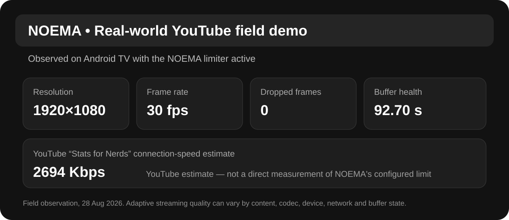

# NOEMA TV Speed Limiter

  

  <strong>Mobile-data control for Android TV and Google TV.</strong> 
  Stream through hotspots and metered connections without letting the TV consume bandwidth without a simple device-side limit.

  
  
  
  

NOEMA TV Speed Limiter is a lightweight, remote-control-friendly Android TV utility for mobile hotspots, travel routers, hotel connections and other metered networks.

The application is distributed through **Google Play**. This public repository contains product information, test documentation, privacy information, support information and public media only. **It does not contain the application source code or a downloadable APK.**

## Install / join the test

### Google Play closed Alpha

[**Join the NOEMA TV Speed Limiter closed Alpha test**](https://play.google.com/apps/testing/ai.noema.tvspeed)

### Google Play store listing

[**Open NOEMA TV Speed Limiter on Google Play**](https://play.google.com/store/apps/details?id=ai.noema.tvspeed)

## Watch NOEMA in action

  

<strong><a href="https://youtu.be/KgacHb2xi4g">▶ Watch the current NOEMA TV Speed Limiter demo on YouTube</a></strong>

## What it does

NOEMA gives the user four simple profiles directly on the TV:

| Profile | Purpose |
| --- | --- |
| **2 Mbit/s Saver** | Maximum data saving |
| **4 Mbit/s Balanced** | Everyday streaming |
| **6 Mbit/s Comfort** | More quality and headroom |
| **Full Speed Home** | Removes the limiter |

The aim is deliberately simple: allow streaming services to adapt to a defined bandwidth budget instead of letting the TV consume mobile data without an easy device-side limit.

## Current version — 1.2.5

The current Google Play test build includes:

- selectable 2 / 4 / 6 Mbit/s profiles
- live download-throughput display
- persistent local usage statistics
- recent-session history
- recovery after Wi-Fi/router reconnects
- built-in diagnostics for TV-side troubleshooting
- an in-app **Report problem** function
- remote-control-friendly Android TV interface
- Android TV / Google TV App Bundle distribution through Google Play
- no root requirement

## Real-world streaming field test

A later Android TV field observation showed YouTube running at **1920×1080 @ 30 fps with 0 dropped frames** while NOEMA was active. YouTube's own Stats for Nerds overlay reported a **92.70 s buffer** and a **2694 Kbps connection-speed estimate** during that observation.

  

The YouTube connection-speed value is an estimate reported by YouTube and is **not** a direct measurement of the configured NOEMA limiter value. Adaptive streaming quality can vary with content, codec, device, network conditions and existing buffer state.

## Privacy by design

NOEMA is designed to work locally on the TV.

- no NOEMA account
- no advertising
- no analytics
- no automatic remote telemetry
- no NOEMA-operated remote VPN server
- usage statistics remain local unless the user explicitly chooses to share a support report

See [PRIVACY.md](PRIVACY.md) for the public privacy information.

## Compatibility

Current target:

- Android TV / Google TV
- Android 8.0+ / API 26+

Real-device testing has already been performed on Xiaomi Android TV hardware. Broader hardware testing is ongoing because Android TV implementations vary substantially between manufacturers and Android versions.

## Testers wanted

NOEMA is currently in closed Alpha testing. Feedback from real Android TV and Google TV hardware is particularly useful.

Helpful reports include:

- device manufacturer and model
- Android / Google TV version
- streaming service used
- selected NOEMA profile
- whether playback starts normally
- buffering or quality changes
- Wi-Fi reconnect behavior
- remote-control navigation issues
- crashes or VPN permission problems

See [TESTING.md](TESTING.md) for the public test checklist. Support reports can also be prepared from inside the app; see [SUPPORT.md](SUPPORT.md).

## Independent project

NOEMA TV Speed Limiter is an independently developed project by **Sandra Wöllner / NOEMA AI**. The project grew out of a practical need to reduce data consumption on Android TV when using limited or mobile internet connections.

Testing, technical feedback and device reports directly help improve compatibility across the fragmented Android TV ecosystem.

## Support NOEMA

NOEMA is developed independently. Financial support helps cover development, testing, infrastructure and the ongoing work required to improve device compatibility and maintain the project.

[**Support NOEMA on GoFundMe**](https://gofund.me/e133b9db8)

Support is voluntary. Testing, technical feedback and sharing the project are equally valuable.

## Public repository scope

This repository is the **public product, testing and support page for NOEMA TV Speed Limiter**.

It intentionally contains **no application source code and no downloadable APK**. The application source and development infrastructure are maintained privately. Official test and release distribution is handled through Google Play.

## Links

- **Closed Alpha:** https://play.google.com/apps/testing/ai.noema.tvspeed
- **Google Play:** https://play.google.com/store/apps/details?id=ai.noema.tvspeed
- **YouTube demo:** https://youtu.be/KgacHb2xi4g
- **GoFundMe:** https://gofund.me/e133b9db8
- **Website:** https://noema-ai.de
- **Support:** support@noema-ai.de

## Project status

NOEMA TV Speed Limiter is under active development and compatibility testing.

Current public test version: **1.2.5**

See [CHANGELOG.md](CHANGELOG.md) for the public release notes.

---

© 2026 Sandra Wöllner / NOEMA AI. All rights reserved.
