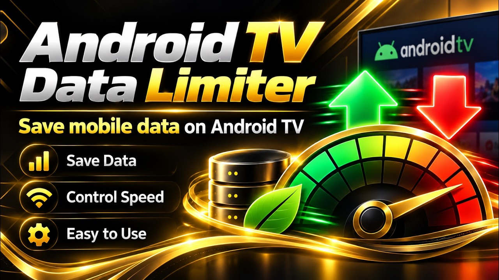
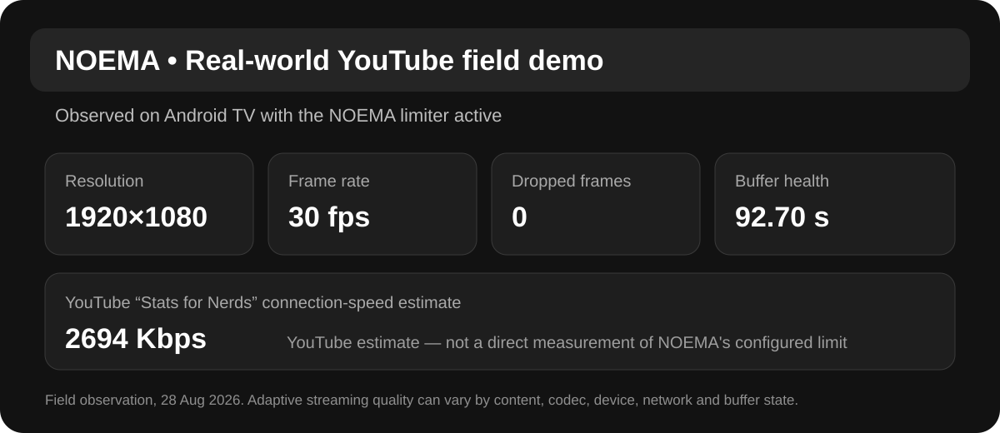

# Android TV Data Limiter — NOEMA AI

**Direktlinks / Quick links:** **[Datenschutzerklärung / Privacy Policy](PRIVACY.md)** · **[Aktuelles Video / Watch video](https://youtu.be/wZ8FxHwZwEE)** · **[Support](SUPPORT.md)** · **[Google Play](https://play.google.com/store/apps/details?id=ai.noema.tvspeed)**

  

*Tippe auf das Bild, um das aktuelle Video zu öffnen. / Tap the image to open the current demo.*

**Control download bandwidth on Android TV / Google TV when using mobile hotspots or metered connections.**

**Release status (9 October 2026):** Android TV Data Limiter **1.2.8 (build 19)** was submitted for Google Play production review in 173 countries/regions. **Google approval is still pending.** The currently visible store listing may display an earlier version until Google approves the update.

  <a href="https://play.google.com/store/apps/details?id=ai.noema.tvspeed">Google Play</a> ·
  <a href="https://youtu.be/wZ8FxHwZwEE">Watch the current video</a> ·
  <a href="PRIVACY.md"><strong>Privacy Policy / Datenschutzerklärung</strong></a> ·
  <a href="SUPPORT.md">Support</a>

## Video demonstration / Aktuelles Video

The **current demonstration** shows the redesigned TV interface, the Android VPN permission dialog and the bandwidth-limiting operation. / Das aktuelle Video zeigt die neue Oberfläche, die Android-VPN-Freigabe und den Betrieb.

**[Watch on YouTube / Video ansehen](https://youtu.be/wZ8FxHwZwEE)**

## Screenshots and graphics / Bilder

**1080p streaming field observation:**

## What it does / Funktionen

The TV remote can select one of four profiles:

| Profile | Function |
| --- | --- |
| 2 Mbit/s Saver | Target download bandwidth limit of 2 Mbit/s |
| 4 Mbit/s Balanced | Target download bandwidth limit of 4 Mbit/s |
| 6 Mbit/s Comfort | Target download bandwidth limit of 6 Mbit/s |
| Full Speed Home | Stops the local limiter / VPN |

The displayed 2 / 4 / 6 Mbit/s values are **target download limits, not guaranteed measured transfer speeds or guaranteed data savings**. Actual streaming and buffering behavior depends on the device, service and network.

The app provides live transfer information, locally stored session statistics, diagnostics and an optional, user-initiated support-report workflow. It is operated with the TV remote and does not require root.

## Privacy / Datenschutz

**[Read the full privacy policy / Datenschutzerklärung öffnen](PRIVACY.md)**

The app uses Android `VpnService` for an **on-device** bandwidth-limiting path. It is not a geographic VPN, does not operate a NOEMA remote VPN server and does not automatically upload usage statistics or diagnostics. More precise details, including local traffic handling, DNS fallback, retention and optional support reports, are in **[PRIVACY.md](PRIVACY.md)**.

For support, see **[SUPPORT.md](SUPPORT.md)** or write to **support@noema-ai.de**. Do not send passwords or access keys.

## Real-device testing

Real Android TV hardware has been tested. A recorded YouTube 1080p/30fps field observation is documented below; it does not constitute a universal playback or data-saving guarantee.

Device support varies by Android TV / Google TV implementation. The app targets Android 8.0+ (API 26+) and TV/remote navigation.

## Official installation and project information

- **Google Play:** https://play.google.com/store/apps/details?id=ai.noema.tvspeed
- **Current video:** https://youtu.be/wZ8FxHwZwEE
- **Privacy Policy:** [PRIVACY.md](PRIVACY.md)
- **Support:** [SUPPORT.md](SUPPORT.md)
- **Testing notes:** [TESTING.md](TESTING.md)
- **Release history:** [CHANGELOG.md](CHANGELOG.md)
- **Website:** https://noema-ai.de
- **Contact:** support@noema-ai.de

This is the **public information and documentation repository**, not the private source-code repository. It contains **no application source code, upload keys or downloadable APK**. Official distribution is via Google Play.

© 2026 Sandra Wöllner / NOEMA AI. All rights reserved.
